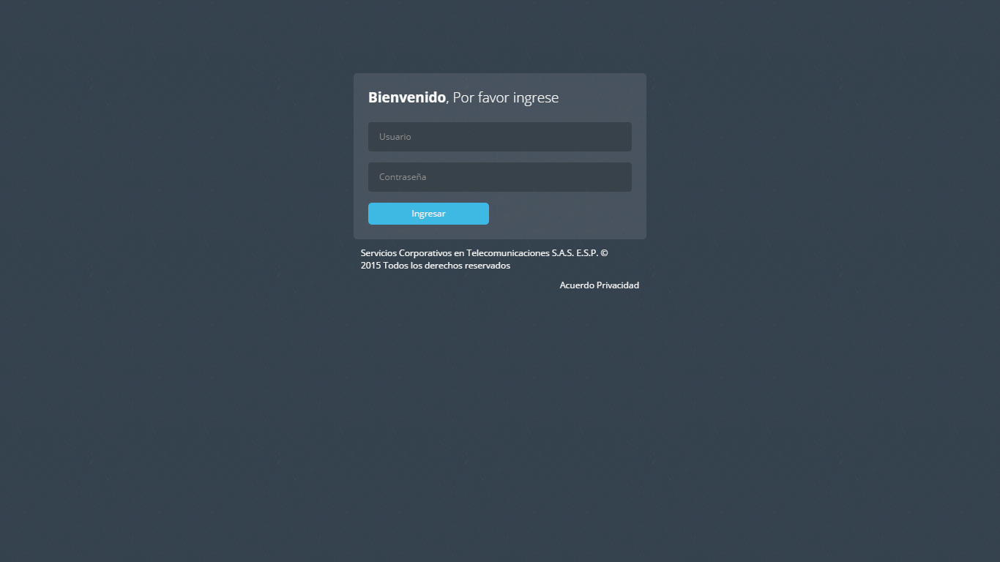
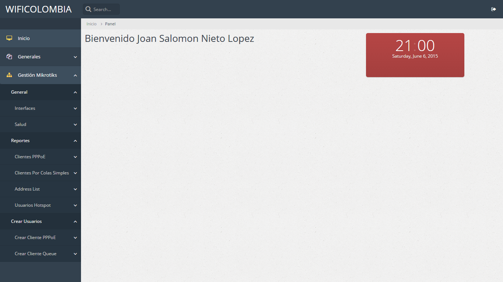
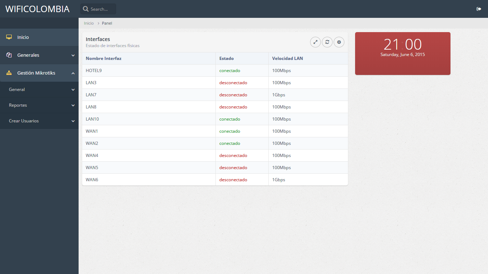
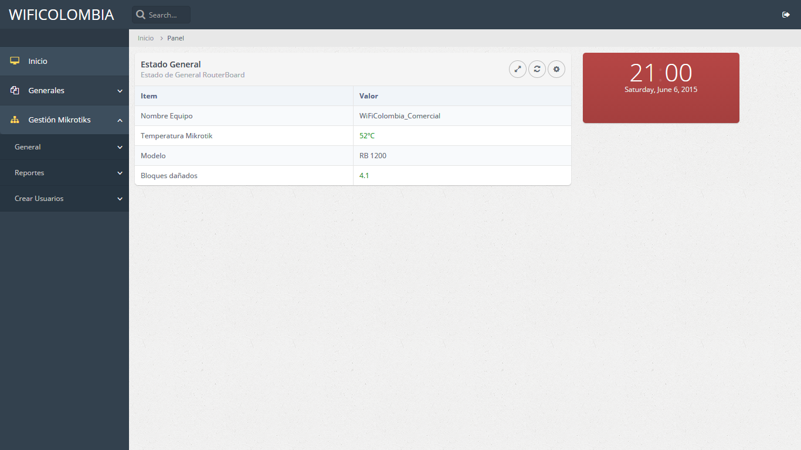
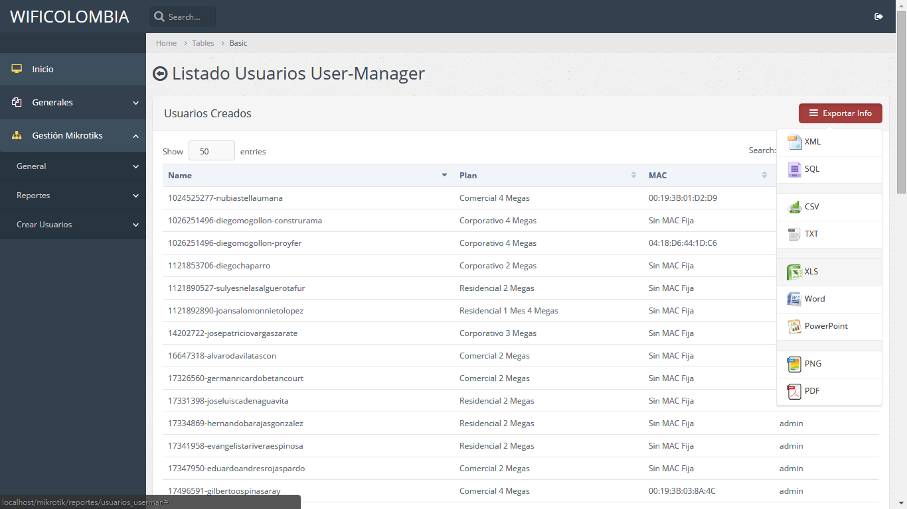
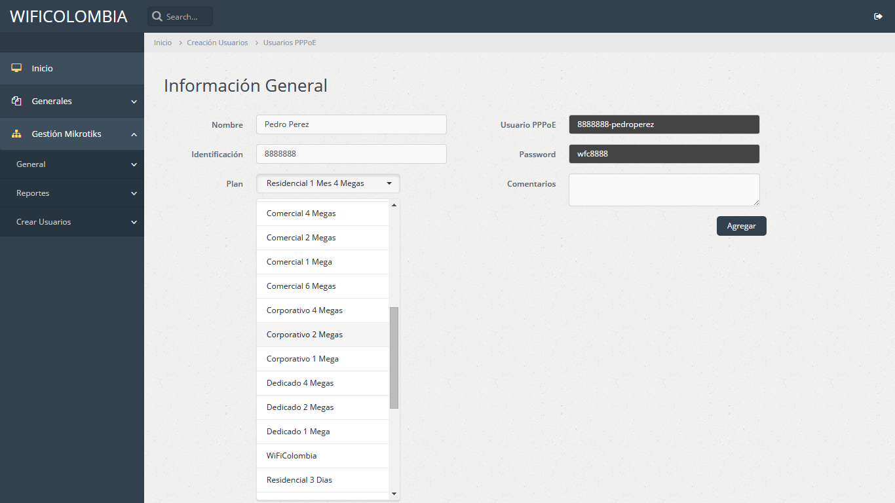
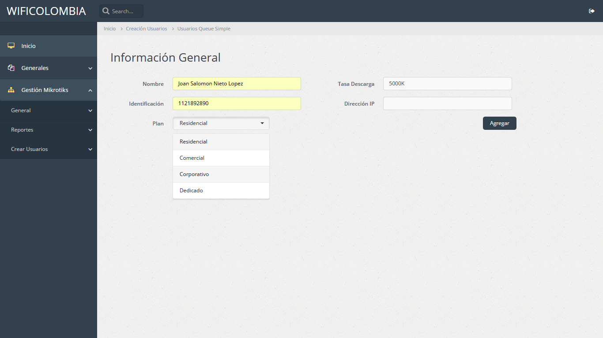

# Sistema de gestión Mikrotik PHP

Esta es la versión inicial del sistema de control de Mikrotik RouterBoard desde PHP.

El directorio includes debe colocarse en la raiz (C:\WAMP  en Windows con WAMP Server o /var/ en linux).

Funcional módulo de Reportes (Lista de usuarios de Userman, Hotspot Active, Address List y Queue Simple) con respectiva capacidad para exportación en CSV,XLS, PDF y demás. Interpreta los datos desde bps y los muestra en Mbps para su fácil uso.

Funional módulo de creación de usuarios (por medio de Queue Simple y Usermanager con asignación de perfil) 
La creación por Queue Simple realiza cálculo automático, solo debe ingresarse la tasa de descarga en Kbps y de acuerdo al segmento el sistema le asigna prioridad y tasa de subida (por ejemplo 1024k en segmento dedicado tiene prioridad 1 y 1024k de subida, mientras que un residencial tiene 1024k en prioridad 8 con 256k de subida).
Tanto Usermanager como Queue Simple tiene verificación (Si usuario ya existe no lo crea) en el caso de Queue por medio de la IP y en usermanager por medio de usuario
El modulo de Usermanager crea automaticamente el usuario y la contraseña tomando los datos del cliente ingresados en el formulario.

Funcional estado general (interfaces y salud del dispositivo).

Se integra con base de datos y control de acceso por medio de PHP - MySQL, integrada en directorio includes.

#Capturas de Pantalla

Login

Inicio

Estado Interfaces

Estado General

Listado Usuarios Usermanager

Creacion Usuario Usermanager para PPPoE o Hotspot

Creacion Usuario Queue con Validación de IP

